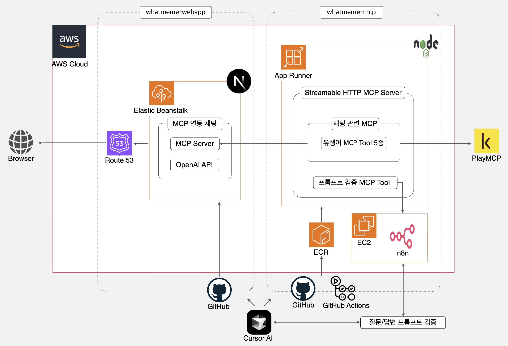

# whatmeme MCP Server

Streamable HTTP 방식의 MCP Server 입니다. 서비스 관련 MCP Tool 5종과, 프롬프트 검증 MCP Tool을 제공합니다.

- Homepage: [https://whatmeme.site/](https://whatmeme.site/)
- PlayMCP: [https://playmcp.kakao.com/mcp/385/](https://playmcp.kakao.com/mcp/385/)

---

## Service Architecture

- Github(MCP Server): [https://github.com/whatmeme/whatmeme-mcp](https://github.com/whatmeme/whatmeme-mcp)
- Github(webapp Server): [https://github.com/whatmeme/whatmeme-webapp](https://github.com/whatmeme/whatmeme-webapp)
